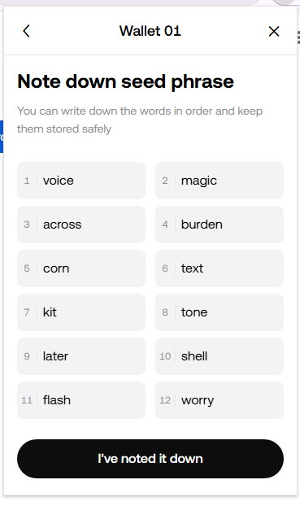

# OKX Passphrase Restorer

Retrieve 12 words passphrase from a backup of your okx wallet and the
password.

TL;DR [here]() you can find a reference video.

## It worked! I want to thank you
Please, make a donation to berardi.dav@gmail.com on PayPal.

## Why?

When you create an OKX wallet you shall always backup your 12 words
passphrase, which is of this format:



There are some cases in which you forget this passphrase, and you're
just left with a backup of your okx wallet (a bunch of LevelDB files)
and your Password.

**Without your password this tool will not work** (but you can use it
in a script to crack the wallet).

## How

You need to have nodejs installed, you can install it following
[this link](https://nodejs.org/en/download) and installing it.

At this point you can install the dependencies using `npm install` in
the directory of this project.

After this, provide the password to `npm start`, for instance:
```
npm start "Proviamo123"
```
